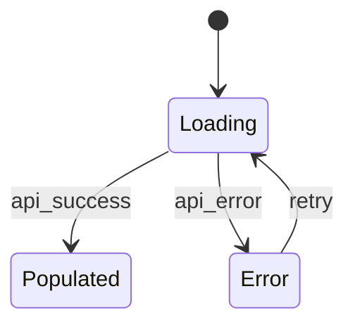

# Step 1 — UI Contract Generation (v2)

<!-- beads-id: br-gatecheck-g1 -->

> **Pipeline position:** Step 1 of 12 • Requires → Step 0 output • Leads to → Step 2 (Contract Compile)

## Input

- `docs/PRDs/feature-x.normalized.json` (from Step 0)

## Processing

### 1.1 Generate `contract.yaml`

Create the primary contract with these required sections:

```yaml
feature: <feature-name>
beads_id: <universal-id-from-prd>
routes:
  - /route-1
  - /route-2

components:
  required:
    - id: <component-id>
      selector: "[data-ds-id='ds:comp:<id>']"
      critical: true|false

viewports:
  - { name: mobile, width: 390, height: 844 }
  - { name: tablet, width: 768, height: 1024 }
  - { name: desktop, width: 1440, height: 900 }

visual_diff:
  global_threshold: 0.2%
  critical_threshold: 0.05%
  mask:
    - "[data-ds-id='ds:comp:clock-001']"

accessibility:
  wcag: AA
  enforce_focus_visible: true

state_transitions:
  - from: loading
    to: populated
    trigger: api_success
  - from: loading
    to: error
    trigger: api_error
```

### 1.2 Generate ASCII Diagrams

For **each screen × each state**, produce a text-based layout diagram:

```
+----------------------+
| Top Nav              |
+----------------------+
| KPI Cards            |
+----------+-----------+
| Chart    | Table     |
+----------+-----------+
```

Each block in the diagram must map to a real `data-ds-id` component.

### 1.3 Generate Mermaid Flow Diagram

Create a visual state/navigation flow:



### 1.4 Generate JSON Storyboard Trajectories — MANDATORY (GAP-28)

> **Storyboard trajectories are REQUIRED, not optional.** Gate A will reject any contract without ≥ 1 storyboard trajectory. If the PRD has no explicit flows, auto-generate a minimum trajectory from the PRD's first user journey.

For Tier 2 Agent Evaluation, provide **complete trajectories** that capture the full journey including tool calls and intermediate reasoning checkpoints — not just end states (GAP-14):

```json
[
  {
    "storyboard_id": "ds:flow:onboarding-001",
    "prd_journey_ref": "Journey 1: New User Registration",
    "trajectory_plan": [
      {
        "step": 1,
        "state": "empty_form",
        "action": "type_input",
        "target": "ds:comp:email-input",
        "reasoning_checkpoint": "Agent should verify input field is visible and enabled before typing"
      },
      {
        "step": 2,
        "state": "validating",
        "action": "click",
        "target": "ds:comp:submit-btn",
        "reasoning_checkpoint": "Agent should confirm the submit triggers loading state, not immediate error"
      },
      {
        "step": 3,
        "state": "error_toast",
        "assertion": "element_visible ds:comp:toast-error-001",
        "recovery_test": {
          "action": "dismiss_toast",
          "expected_state": "empty_form",
          "assert_no_reload": true
        }
      }
    ]
  }
]
```

> The Evaluator must capture the Implementor's **full conversation trace** (tool calls + args + reasoning interleaved) per iteration and store as `rollout-{id}-iteration-{n}.jsonl` in `docs/design/reports/` for RFT dataset assembly.

### 1.4 Generate Component Map

Map ASCII blocks → actual component selectors:

```json
{
  "top-nav": "[data-ds-id='ds:comp:top-nav-001']",
  "kpi-cards": "[data-ds-id='ds:comp:kpi-cards-001']",
  "chart": "[data-ds-id='ds:comp:chart-001']",
  "table": "[data-ds-id='ds:comp:positions-table-001']"
}
```

### 1.5 PRD ↔ Design System Conflict Detection (GAP-38)

Before emitting the contract, run a conflict scan:

1. For each color/style directive in the PRD (e.g., "button must be blue"), check if a matching DS token exists.
2. For each required component, verify it exists in `design-tokens.json`.
3. If conflicts found, emit a `PRD_DS_CONFLICT` list:

```markdown
## PRD ↔ DS Conflicts — feature-x

- CONFLICT: PRD requires "blue CTA" but `--ds-color-primary` = green. Options: (a) update token, (b) local override, (c) update PRD.
- CONFLICT: PRD references `ds:comp:data-export-btn` — not found in design-tokens.json.
```

**Gate A MUST surface this list.** Human decides resolution before Implementor starts. No silent resolutions allowed.

## Output

| Artifact         | Path                                                    |
| ---------------- | ------------------------------------------------------- |
| Contract YAML    | `docs/design/contracts/feature-x.contract.yaml`         |
| ASCII diagrams   | `docs/design/contracts/feature-x.ascii.md`              |
| Flow diagram     | `docs/design/contracts/feature-x.flow.mmd`              |
| JSON Storyboard  | `docs/design/contracts/feature-x.storyboards.json`      |
| Component map    | `docs/design/contracts/feature-x.component-map.json`    |
| Conflict report  | `docs/design/contracts/feature-x.prd-ds-conflicts.md`   |

### Contract Quality Scoring Engine (Stage 1 RFT Loop)

This scoring engine is used by **TASK 1B (EVALUATE)** in the Stage 1 Ralph Loop. After GENERATE (g1+g2) produces contract artifacts, this engine scores them on 5 pillars to determine if the contract is ready for Gate A.

**Contract Quality Score (0–100):**

| Pillar | Weight | Checks |
|--------|--------|--------|
| **PRD Coverage** | 25% | Every screen + state + journey in PRD → matching wireframe + storyboard |
| **Component Traceability** | 25% | Every ASCII block → `data-ds-id` in `component-map.json` |
| **Storyboard Completeness** | 20% | Every user journey has ≥1 trajectory; error recovery paths present |
| **Layout Compilability** | 15% | `layout-rules.json` parses cleanly; zero `AMBIGUOUS_RULE` flags |
| **Conflict Resolution** | 15% | All `PRD_DS_CONFLICT` items detected and surfaced |

**Scoring Mechanics:**
- Gradient penalty: `missing_items × (weight / total_items_expected)` — every improvement is rewarded
- Rollout ID: `rl-stage1-YYYY-MM-DD-NNN` per iteration
- Pillar deltas tracked per iteration
- Cross-iteration regression check (iteration ≥ 2)
- Attribution: `evaluator_contract` | `prd_gap` | `unknown`
- All graded rollouts → `docs/rft-dataset/{prd_id}/stage1/`

**Convergence:** Score ≥ 90 AND zero `AMBIGUOUS_RULE` → `GATE_A_READY`. Otherwise, Prioritized Fix Queue sent back to GENERATE. See `gsafe-uiux-ralph-loop-stage1.md` for full convergence decision table.

**Output:**

```json
{
  "contract_quality_score": 87,
  "pillars": {
    "prd_coverage": { "score": 22, "max": 25, "missing": ["error state for /settings"] },
    "component_traceability": { "score": 25, "max": 25 },
    "storyboard_completeness": { "score": 16, "max": 20, "missing": ["error recovery for journey 2"] },
    "layout_compilability": { "score": 12, "max": 15, "ambiguous_rules": 1 },
    "conflict_resolution": { "score": 12, "max": 15 }
  },
  "rollout_id": "rl-stage1-2026-03-13-001",
  "iteration": 1,
  "verdict": "CONTINUE",
  "fix_queue": ["Add error state wireframe for /settings", "Resolve AMBIGUOUS_RULE in kpi-cards"]
}
```

## Switching Rules

| Product Type      | Additional Requirements                    |
| ----------------- | ------------------------------------------ |
| **Web**           | Routes + responsive breakpoints mandatory  |
| **Mobile native** | Screen IDs + orientation + safe-area rules |
| **PWA**           | Add offline/rehydration state transitions  |

See [product-switching.md](./product-switching.md) for full details.

## Next Step

→ [g2-contract-compile.md](./g2-contract-compile.md)
